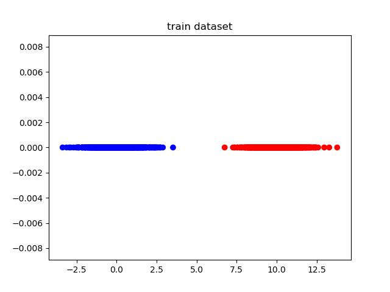
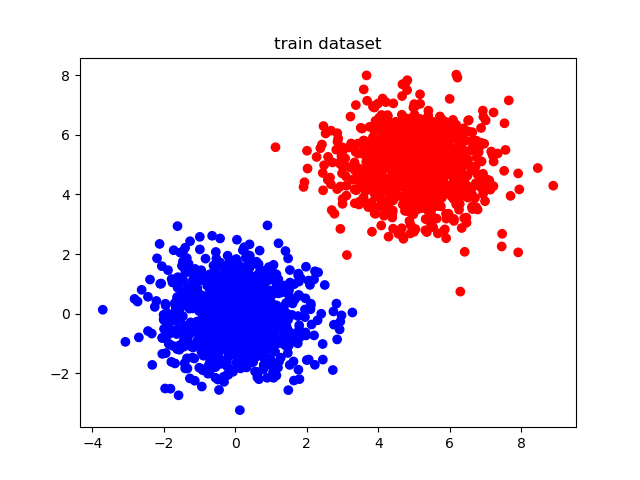
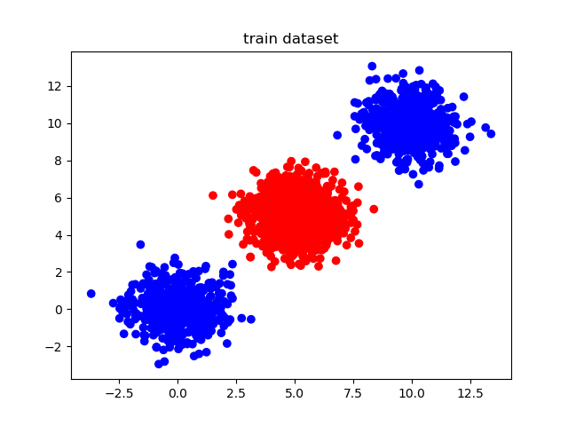
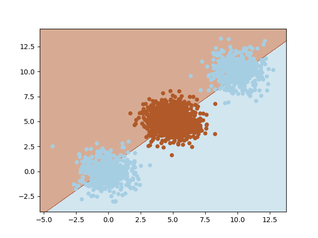
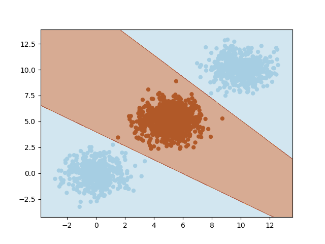

# deep\_learning\_playground
 Playground for deep learning toy problems

## simple\_classification

This one is a simple binary classification problem solved using deep learning.

There is different scenarios implemented.

### You can choose between one and two dimensions dataset

#### One dimension dataset
```
python main.py --number_of_dim 1 --spacial_offset 10
```


#### Two dimension dataset
```
python main.py --number_of_dim 2 --spacial_offset 10
```


### You can choose between linearly or non-linearly separable dataset

#### Dataset linearly separable
```
python main.py
```


#### Dataset non-linearly separable
```
python main.py --complicated
```

### You can choose between a single layer perceptron or a two layer one

#### Without hidden layer
```
python main.py
```

#### With hidden layer
```
python main.py --hidden_layer
```

#### Note
When using the single layer perceptron, you cannot solve the non-linear problem.
```
python main.py --number_of_dim 2 --complicated --spacial_offset 5
```


Indeed, you need at least one hidden layer to classify this problem correctly
```
python main.py --number_of_dim 2 --complicated --spacial_offset 5 --hidden_layer
```


